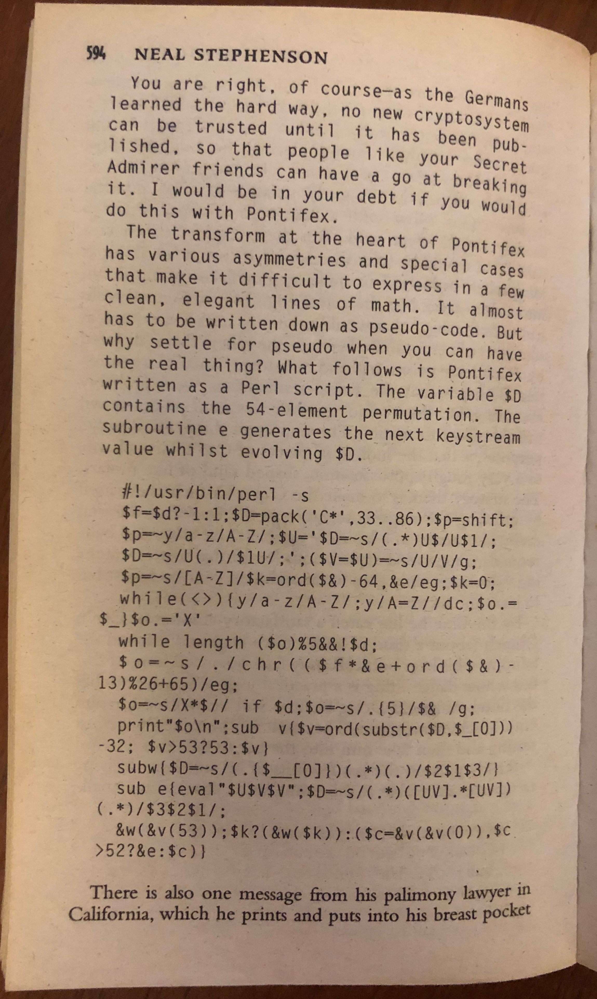
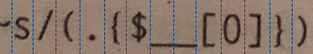
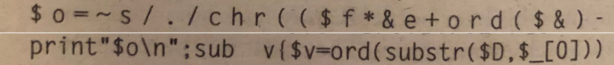

# Pontifex

## Overview

In Neal Stephenson's book
["Cryptonomicon"](https://www.google.com/search?q=cryptonomicon+book),
about halfway through, is a perl script describing a cryptosystem named
Pontifex.

I am not a cryptographer, but I *am* a reasonable programmer: so I thought it'd
be fun to make some notes as I try to understand what's the script is trying to
do, and even better if I could reimplement it in another language, and have my
implementation exchange messages successfully with other implementations.

Difficulty:
* Ignore the book's walk-through of Pontifex in the Appendix. I
didn't realise it was there until after I started but even if I had, I would
have skipped it. I want to learn what I can from reverse engineering first.
* Similarly ignore walk-through's available online. I also found those only
after I'd started
* Get as far as I can with what I know of perl before looking stuff up!

## Background
I already knew to expect some sort of cryptosystem: before the novel begins
Bruce Schneier gets an Acknowledgment for inventing 'Solitaire' and
allowing its use, and Ian Goldberg for writing the perl script.
- That the system is called 'Solitaire' is a clue playing cards may be involved.
Indeed the book goes on to describe two characters using playing cards to
communicate.
- I know of Bruce Schneier from way back when. I read his book "Applied
Cryptography"
too, even going so far as to implement a couple of the schemes described
therein. I don't have strong maths skill, so didn't do anything with what I
learned.
- I'm not familiar with Ian Goldberg but googling Bruce and Ian sees many joint
references, so I assume they're of similar minds. That is, it's more likely I
misunderstand what they're doing, than that Ian made an error implementing
Bruce's system.

## The program 1: original

The text reads "The variable $D contains the 54-element permutation. The
subroutine e generates the next keystream value whilst evolving $D."
I can probably ignore that text for now.
- In context there's not yet any indication of what a 54-element permutation
might be about. But a playing cards come in a set of 52, plus jokers. Four in my
real set here. The book later describes the characters using two jokers on top,
so 54.
- Keystream sounds like it might be a stream that either is the data to be
encrypted, or more likely, modifies the data to be encrypted
- "evolving $D" suggests that each bit of data sees $D changed, perhaps even
changed by that bit of data rather than in a set way.
I can tell I don't really know enough to understand what I'm being shown.

## The program 2: first look through
- It jumps out that the program has been written to be dense, but not to be
obfuscated.
    - A program that is not dense will tend to be written with readability in
    mind. For example, each perl instruction is normally terminated with a
    semi-colon, yet the second line contains three of them:
```
$f=$d?-1:1;$D=pack('C*',33..86);$p=shift;
		^                    ^        ^
```
Also, there will tend to be spacing to better indicate separate elements of the
instruction. For example:
```
$f=$d?-1:1;
is more readable as
$f = $d ? -1 : 1;
```
	- Why would the program be "dense"?
	    - Looking quickly, there totals 24 semi-colons suggesting around 24
	    lines. The page itself has 40 lines, and this in a book of 1152
	    pages.
	    The final page is only half filled, so the program could have been
	    written readably without adding to the page count. The script didn't
	    need to be dense because of length.
	    - The code is written in the form of an email, and email has a maximum
	reliable line length of 78 characters. The longest line in the printed
	code is 60 characters. The script didn't need bunching up for line
	length, either.
	- A program that is Obfuscated will endeavour to conceal ('obfuscate')
readability without changing the result of running it. Two clues that doesn't
seem to have
happened here is the single character variable names, and the direct encoding of
string characters. For example we could have seen:
```
$f=$d?-1:1;$D=pack('C*',33..86);$p=shift;
  written as
$OO=$OO0O0?-1:1;$OO000=pack("\x43\x2a",33..86);$OO0=shift;
```
    - I can imagine, then, that the code has been compressed to Big Up its
    terrifying complexity to the uninitiated, but not so much that the initiated
    would walk away.
- And here comes my Big Error! It next jumps out at me that the script appears
incomplete. The first two instructions
read:
```
#!/usr/bin/perl -s
$f=$d?-1:1;
```
    - The first line is very traditional, describing that the code to
    follow is to be run through the perl interpreter, with "-s" being to
    use strict rules. (In fact "-s" *doesn't* mean that, I assumed that, leading
    to a goose chase. I return to "-s" at the end when I at last think to look
    it up)
    - But the second line - the very first instruction - says to make $f equal
    to either -1, or 1, depending on the value of $d. But $d hasn't got a value,
    as this was the very first line.
    - What's incomplete here is that there wasn't a Usage comment, not that
    there wasn't an initial line for $d.
- The last big jump out is that there seem to be quite a few errors.
    - Consider the line:
```
subw{$D=~s/(.\{$_[0]\})(.*)(.)/$2$1$3/;}
```
    There is no instruction ```subw``` in Perl. It's 2022 now, I've looked, and
    there was no instruction ```subw``` back then either.
    - Consider also the line:
    

    I've put blue lines roughly halfway between each character. Notice that
    seems to mean we get double underscores ```$__[0]``` and not ```$_[0]```.
    What on earth does $__ refer to? It's not part of perl I recognise.
    - Finally, contrast these two lines:
    
The first uses 27 character spaces, the second uses 43. Or are there 16 uses of
the space bar in the first line, that have some meaning? Perl didn't give
semantic meaning to whitespace. But then Python does now, so maybe my memory is
faulty, and Perl does - I just never came across it.
	- Also note ```$_[0]``` with just a single underscore. That's what I
	would have expected, but anyway I spent a few mins trying to discover
	if ```$__``` actually exists as a thing - I decide not.
- So what does this all mean? I think:
    * The code has been made less clear by Ian Goldberg to chalenge us
    * The code has then probably been butchered by the typesetter

## The program: clean up
What _should_ the perl script read, after corrections? I think this:

```
#!/usr/bin/perl -s
$f=$d?-1:1;$D=pack('C*',33..86);$p=shift;
$p=~y/a-z/A-Z/;$U='$D=~s/(.*)U$/U$1/;
$D=~s/U(.)/$1U/;';($V=$U)=~s/U/V/g;
$p=~s/[A-Z]/$k=ord($&)-64,&e/eg;$k=0;
while(<>){y/a-z/A-Z/;y/A-Z//dc;$o.=$_;}$o.='X'
while length ($o)%5&&!$d;
$o=~s/./chr(($f*&e+ord($&)-13)%26+65)/eg;
$o=~s/X*$// if $d;$o=~s/.{5}/$& /g;
print"$o\n";sub v{$v=ord(substr($D,$_[0]))-32; $v>53?53:$v;}
sub w{$D=~s/(.{$_[0]})(.*)(.)/$2$1$3/;}
sub e{eval"$U$V$V";$D=~s/(.*)([UV].*[UV])(.*)/$3$2$1/;
&w(&v(53));$k?(&w($k)):($c=&v(&v(0)),$c>52?&e:$c)}
```

This should correct:
- too much/ too few spaces throughout to match dominant style
- ```$__[0]``` as ```$_[0]```
- ```subw``` to ```sub w```

And this marks my [first commit to this repo](https://github.com/Csi18nAlistairMann/pontifex/blob/6cad6d345791a428300e02ef77d24bfa8d4f4ac6/pontifex.pl).

## The program: make readable
I'm looking to make the script readable, not pass the style guide :-)
* One terminating semicolon per line:
```
$f=$d?-1:1;$D=pack('C*',33..86);$p=shift;
```
becomes
```
$f=$d?-1:1;
$D=pack('C*',33..86);
$p=shift;
```
* Add spaces for readability. Above becomes
```
$f = $d ? -1 : 1;
$D = pack('C*', 33..86);
$p = shift;
```
Repeat throughout and this marks [the second commit to repo](https://github.com/Csi18nAlistairMann/pontifex/blob/72b683e86846c99b5b2b005b7e1f745f38c96233/pontifex.pl).

## The program: what does each part do?
Now I work through the code renaming the variables in line with what role they
seem to play

### $f from the mysterious undefined $d
First, what is ```$f = $d ? -1 : 1;``` doing?

Whatever $d is, $f could only ever be -1 or 1. As a binary choice,  I wondered
whether that is the
flag by which the program knows to encrypt, or decrypt. Sure enough:
```
$ echo "abc def" | ./pontifex.pl
EYMBM EPDBE
$ fg
emacs pontifex.pl
$ echo "EYMBM EPDBE" | ./pontifex.pl
ABCDE F
```
I don't see a later way to communicate direction, so Goldberg must be manually
changing it. For the moment I can improve readability by changing $f to
$encrypt_or_decrypt.

### The mysterious undefined $d
We use $d twice more, even though its undefined. First when adding Xs to the end
of a string:
```
$o .= 'X' while length($o) %5 && !$d;
```
and then again when removing Xs from the end of a string.
```
$o =~ s/X*$// if $d;
```
That is, it only matters if $d is something, or nothing. The same binary choice
as $f. But why then do we need both? I wonder if when $f is -1, $d is 1 and
vice versa? Sure enough, suitable print statements show we get $f = -1 when
$d = 0, and $f = 1 when $d != 0.

All this means that even though $f and $d are not the strict opposite of each
other, they are used that way, so I can improve readability by renaming $d to
$decrypt_or_encrypt.

### $D the 54 character string
The code: ```$D = pack('C*', 33..86);``` makes $D equal to the string
```!"#$%&'()*+,-./0123456789:;<=>?@ABCDEFGHIJKLMNOPQRSTUV```. It's clear from
experimentation that unusual characters in the message are disallowed - although
I haven't seen
where they're removed yet:
```
$ echo "abc{123def" | ./pontifex.pl
EYMBM EPDBE
$ echo "abcdef" | ./pontifex.pl
EYMBM EPDBE
```
That makes me think $D isn't being used to substitute characters (ie, A can't
be substituted by 3, nor can Z become '='.)

Instead, if we look at uses of $D such as
```$v = ord(substr($D, $_[0])) - 32;``` ("make $v the numeric value of the nth
character in $D, less 32") we can make some observations:
    * The lowest number $v could be is 33 (from
    ```$D = pack('C*', 33..86);``` above) less 32 = 1, and "1" is not a
    printable ASCII character
    * It follows that $D is not intended to supply printable characters
    * In which case $D is supplying an array of numbers, offset up the ASCII
    table, so Goldberg can use string manipulation to implement manipulating the
    array of numbers.

I shall rename $D to $deck_of_cards for now, but I wonder if there's a better
name for it, reflecting its actual role.

### The mysterious $p
What then is the role of $p? It's taken from the command line, and clearly has a
role to play as it modifies the output:
```
$ echo "EYMBM EPDBE" | ./pontifex.pl
ABCDE F
$ echo "EYMBM EPDBE" | ./pontifex.pl abc
ASWPW RQTUI
```
And yet it's reversible too:
```
$ echo "abc def" | ./pontifex.pl ghi
KWQTZ BBNZH
$ fg
emacs pontifex.pl
$ echo "KWQTZ BBNZH" | ./pontifex.pl ghi
ABCDE F
```
So both parties have to know $p, and yet it does not form part of the message.
I've seen something similar in the 1980s: on the ZX Spectrum, a request for a
random
number would always return the same sequence of (pseudo-)random numbers. Very
fast, but very predictable! Before starting then, one had to move a random
distance into that sequence using ```RANDOMIZE n```
([ZX Basic docs](https://zxbasic.readthedocs.io/en/docs/randomize/).) So I
wonder, does the same ciphertext come out for *similar* plaintext?

Sure enough:
```
$ echo "Alistair was here" | ./pontifex.pl
WOYUL BQLST YULJO```
$ echo "Alistair is there" | ./pontifex.pl
WOYUL BQLEL ZULJO
```
Someone would quickly work out that ```WOYUL BQL``` starting the message had the
same meaning both times (and so does ```ULJO``` ending it.) $p must have much
the same use as ```RANDOMIZE```. $p acts as a Password.

Continuing with $p we see first ```$p =~ y/a-z/A-Z/;``` which tells us that
all the lower case letters should be converted to their upper case equivalent.

We then get:
```
$p =~ s/[A-Z]/$k = ord($&) - 64, &e/eg;
```
For every uppercase letter in $p, assign to $k the result of ```ord($&) - 64```
(take the letter found, convert it to it's ASCII number, then subtract 64") and
then do ```, &e``` and assign the result of each back to $p.

(These changes to $p are ignored but out of interest, that means
feeding in "ABCDEF 123GHI &&\*" makes $p into "111111 123111 &&\*".)

How does ```, &e``` fit in? "e" is a subroutine later in the script, so
presumably its being
called each time. Indeed so:
```
$ echo "Alistair is there" | ./pontifex.pl abcde
About to start
Entered e
Entered e
Entered e
Entered e
Entered e
...
```
So I looked it up. This is a use of the
[comma operator](https://en.wikipedia.org/wiki/Comma_operator)
, which treats the two
sides something like a compound statement:  ```$k = ord($&) - 64, &e``` thus
means "Assign a value to $k then call e()". Looking quickly at e() we see the
line ```$deck_of_cards =~ s/(.*)([UV].*[UV])(.*)/$3$2$1/;``` which swaps the
first and last sections of the deck. This must be some kind of shuffle. As $k is
mentioned shortly after this probably means that the shuffle happens differently
depending on $k's value.

Mysterious $p is, I think, therefore a password, used to shuffle the deck of
cards differently according to the letters it contains.

### Mysterious $k
So far I've worked out that $d is probably from Direction; $D is probably from
Deck Of Cards, and $p is probably from Password. I don't know how $f got its
name. So is $k's name a clue to its purpose?

$k is used twice: once in the setup that shuffles the pack, and is then zeroed:
```
$p=~s/[A-Z]/$k=ord($&)-64,&e/eg;$k=0;
```
and then again in w():
```
$k ? (&w($k)) : ($c = &v(&v(0)), $c > 52 ? &e : $c)
```
$k is here only something other than zero IF we're working through the password
in setup AND the character we're looking at is in A-Z. If not A-Z, and when not
in setup, $k is zero and so doesn't fire. So $k is governing getting the deck
into the particular order associated with $password and valid characters in it,
cycled through $k. In a sense, $k is used to "Key" like an index into the deck
of cards. Seeing as Key has a particular cryptographic meaning though, I think
that's probably not where k comes from.

$k I renamed to $index_into_deck

### $U and $V containing code
A feature of perl is that code can be kept in a string, and run later. Like a
cross between an olde-tyme macro expansion, and subroutine. That
happens here with $U and $V, where
```
$U = '$deck_of_cards =~ s/(.*)U$/U$1/; $deck_of_cards =~ s/U(.)/$1U/;';
```
and $V is almost identical because of ```($V = $U) =~ s/U/V/g;``` which copies
the string over, then replaces all uses of U with V:
```
$V = '$deck_of_cards =~ s/(.*)V$/V$1/; $deck_of_cards =~ s/V(.)/$1V/;';
```
They both have two statements.
```s/(.*)U$/U$1/;``` says that IF the deck ends with the character U, to move
the U to the front of the deck. "ABCUDE" would see no change but "ABCDEU" would
become "UABCDE".
```s/U(.)/$1U/;``` says that wherever U is, swap it with the character
immediately after. Remember U could no longer appear last. "UABCDE" would become
"AUBCDE" and "ABCDUE" would become "ABCDEU"
The code in $U and $V only get called in one place, in e(), in the line
```eval"$U$V$V";``` which will "run U() once, and V() twice".
The effect of each is to move the U once place to the right, rotating the U to
the left end if required first.

The strings would be more readably named $rotate_u_right and $rotate_v_right.

### The unmysterious $o
$o is eventually used in the output: ```print"$o\n"```

$o is more readable as $output.

### Better names for subroutines 1: $v
Given a value n, look up the nth card in the deck and return its value, capped
to 53 if required.

$v becomes get_nth_card_from_deck_cap53()

### Better names for subroutines 2: $e
Whenever we call e() we rotate the U and V cards, then we swap whatever's
left and right of them.

We then get the ordinal of whatever card is last as n, and subtract 32.

We swap the first n cards with all the remaining cards except for the last one (so,
effectively rotating all the cards left by n, except for the last card.)

If we're scanning the password
(and so setting up the deck for first run) we do the above again, this time
using the $index_into_deckth card instead of the ordinal-32 in the last card.
If the password element
is not a letter, or we're no longer setting up, we either return character $c,
or run
e() again - recursively! - and return what it finds.

e() is definitely some kind of engine then - it transforms the deck at the start
of each call, before attempting to use it
* Find the "U" card and move it right (rotate first to left side if required)
* Find the "V" card and move it right twice (rotate it to left side if either
already far right)
* Swap whatever's left of the U or V with whatever's right of the V or U
* Find the ordinal n on last card ...
* ... and swap the 0->n with n+1->last-1 cards
* IF we are setting up, we repeat the above two steps with an index into deck
that's based on the password typed on the command line.
* ELSE if we are not setting up, or if the password contained a character other
than A-Z return a character (ignored during setup of password)
    * Get the ordinal written on the first card n1
    * Now $c = the oridnal written on the n1th card,
    * if c > 52
	* recurse into e() and return its result
    * else
	* return c

So i'll rename e() as run_the_engine()

### Final $c
The final variable, $c, appears in just the last line of run_the_engine():
```
    $index_into_deck ?
	# If we're in setup, and we see a A-Z in the password
	(&rotate_deck_by_n($index_into_deck))
	# shuffle according to $index_into_deck
	: ($c = &get_nth_card_from_deck_cap53(&get_nth_card_from_deck_cap53(0)),
	   $c > 52 ? &run_the_engine : $c);
```
During the password setup, $index_into_deck changes, which causes the
rotate_deck_by_n to fire.

But during a run, it returns a character - either the ciphertext for a plaintext
character, or the plaintext of a ciphertext character. The engine doesn't know
which way round this is going, but the calling regular expression does:
```
$output =~ s/./chr(($encrypt_or_decrypt * &run_the_engine + ord($&) - 13) % 26 + 65)/eg;
```

$c is therefore short for $character as the engine can handle just one at a
time.

## Readable software
Variable and subroutine name changes now means the code looks like this:
```
#!/usr/bin/perl -s
# $decrypt_or_encrypt = 1;
$encrypt_or_decrypt = $decrypt_or_encrypt ? -1 : 1;
$deck_of_cards = pack('C*', 33..86);
$password = shift;
$password =~ y/a-z/A-Z/;
$rotate_u_right = '$deck_of_cards =~ s/(.*)U$/U$1/; $deck_of_cards =~ s/U(.)/$1U/;';
($rotate_v_right = $rotate_u_right) =~ s/U/V/g;
$password =~ s/[A-Z]/$index_into_deck = ord($&) - 64, &run_the_engine/eg;
$index_into_deck = 0;
while(<>)
{
    y/a-z/A-Z/;
    y/A-Z//dc;
    $output .= $_;
}
$output .= 'X' while length($output) %5 && !$decrypt_or_encrypt;
$output =~ s/./chr(($encrypt_or_decrypt * &run_the_engine + ord($&) - 13)
% 26 + 65)/eg;
$output =~ s/X*$// if $decrypt_or_encrypt;
$output =~ s/.{5}/$& /g;
print("$output\n");
sub get_nth_card_from_deck_cap53
{
    $v = ord(substr($deck_of_cards, $_[0])) - 32;
    $v > 53 ? 53 : $v;
}
sub rotate_deck_by_n
{
    $deck_of_cards =~ s/(.{$_[0]})(.*)(.)/$2$1$3/;
}
sub run_the_engine
{
    eval"$rotate_u_right$rotate_v_right$rotate_v_right";
    $deck_of_cards =~ s/(.*)([UV].*[UV])(.*)/$3$2$1/;
    &rotate_deck_by_n(&get_nth_card_from_deck_cap53(53));
    $index_into_deck ?
	(&rotate_deck_by_n($index_into_deck))
	: ($character = &get_nth_card_from_deck_cap53(&get_nth_card_from_deck_cap53(0)),
	   $character > 52 ? &run_the_engine : $character);
}
```

## First analysis of program
I've now kind of got a handle on what's going on.
* Goldberg has missed out an initial line to say if we're encrypting or
decrypting. As this impacts the very first line of code he did give us, I don't
think that was an accident - maybe sending a message ;-)
* He has also missed out how the code should be used. We had to reverse engineer
that there should be a password in the arguments, and the data to finesse on
STDIN.
* He's used some nice tricks in perl to achieve what he wants:
    * Writing a single piece of code to handle encrypting and decrypting, blind
    to either, but whose functionality results naturally from the presence of a
    single term -1 or 1
    * Code in strings, saves bytes!
    * Code in regular expressions, expands what they're capable of
    * [Comma operators](https://en.wikipedia.org/wiki/Comma_operator) make for
    more complex single lines
    * Default Variable use. Keeps bytes down again
    * My favourite: String manipulation to fake number array handling
* The code itself divides in 3:
    * Setup how a given password shuffles a deck of cards, and code for use
    later
    * Retrieving data from STDIN, transforming it, and reporting it
    * Helper code, and the engine.
* En- or decrypting the transformation happens in place, instead of in a
separate variable
* The plaintext to be encrypted cannot end with "x" or "X"

## Readbility: comments
We now see we can bring related code together and start adding comments. I also
renamed $index_into_deck to $initial_shuffle_index as a bit clearer.

## Testing Interoperability
I found two online encoder/decoders:
* [dCode.fr](https://www.dcode.fr/solitaire-cipher-schneier)
* [ermarian.net](https://ermarian.net/services/encryption/solitaire)

And of course they indicated a problem. Strangely, no problem if I didn't use a
password. And a message encoded by one can be decoded by the other, suggesting
my code had an error in the password shuffle. Sure enough, I had moved the U and
V code down the script so neither was actually defined at the time of the
initial shuffle. Put
it back where Goldberg had left it, and my code can now communicate with theirs
:-)

## Challenge: port the perl script to PHP
I think I understand the code well enough to port it. I don't understand the Why
it's doing various things, but I believe I grok the What. PHP being reasonably
close to Perl - it's also a scripting language - I should be able to reimplement
pontifex with it. This is known as _porting_.

For the sake of interest, I made a Rosetta script:
[pontifex-rosetta-perl.php](https://github.com/Csi18nAlistairMann/pontifex/blob/master/pontifex-rosetta-perl.php)
which takes the existing perl script, and directly translates each line or block
into the PHP equivalent. While this looks more of a mess, you may find it easier
when considering pontifex.php - the PHP solution to the challenge, and which
should be more readable.

The perl and PHP scripts can be chained such that the output of one can be the
input to the next:
```
$ echo "Helloworld" | ./pontifex.pl
LBVJW VGXPK
$ echo "Helloworld" | ./pontifex.pl | ./pontifex-rosetta-perl.php
HELLO WORLD
echo "Helloworld" | ./pontifex.php | ./pontifex.pl
HELLO WORLD
$

```

My 'Rosetta' PHP version also includes some basic tests just to verify my
understanding as I went along.

Cleaning up the Rosetta version we end up with [this for my PHP port.](
https://github.com/Csi18nAlistairMann/pontifex/blob/master/pontifex.php)

## Second analysis of program

Now that I've reverse-engineered the perl script sufficient to port it to a
different language, I can make a reasonable stab at what's going on.

* The core of the system
    * run_the_engine() The engine runs once per character in the message,
    shuffling the deck the choices first, then using the first card to decide on
    a second which will actually be the character used. Thus we know that an
    encrypted message exactly thirty characters long will have come from a
    plaintext exactly thirty characters long.
    * transform_text() The script addresses each character in the message in
    turn, swapping it where it stands for whatever replaces it: this routine
    governs how the engine is applied to that end.
    * initial_shuffle() which governs the deck's starting arrangement as
    described by the password. Thus, both parties need to know what password was
    used.

* Deck and cards handling
    * Deck Rotation, where all the deck (except for the last character) are
    shifted left by the given number. Any vanishing off the left appear
    immediately at the right
    * Card Rotation, where one of two cards - in the deck as "U" or "V" - go to
    the left if they're already at the right, and then get moved one place right
    * Card interpretation, where a given card has a numeric value on it that's
    needed elsewhere.

* The main part of the program
    * Read in whatever's piped through
    * If encrypting, pad it with Xs first
    * Run the encryption or decryption. This happens with a -1 or +1 which
    causes the maths to go backwards or forwards and so means we can use the
    exact same code to encrypt *or* decrypt
    * If decrypting, remove all Xs at the end - they're (probably) padding
    * Lastly print out in groups of five characters at a time

* Finally the Setup
    * Assess the direction we'll go - encrypting or decrypting
    * Retrieve the password from the command line and force it to uppercase
    * Arrange the cards.
	* We start off in what might be considered Factory Order:
    Ace of Diamonds up through the numbers to Jack, Queen, and King, then repeat
    with Hearts, Spades, and Clubs, with two Jokers. (In my
    real life pack I'll have the black/white one first, the colour one second.)
    The cards in real life are numbered 0 to 53 in the above order, so the Ace
    of Spades would numbered 26, and so of course would keep that number
    wherever it is in the shuffled pack. These scripts model that arrangement by
    using the ASCII codes from 33 ("!") to 86 ("V") in a long string:

    ```!"#$%&'()*+,-./0123456789:;<=>?@ABCDEFGHIJKLMNOPQRSTUV```
	* We then shuffle that above pack, that above string, depending on the
	characters A-Z in the password.

## Third analysis of the program
* The original perl is extremely simple, so the plain text of your message
    cannot end with "X". The two sites I linked implement this code differently,
    so messages with "X" at the end ARE allowed, which means the implementations
    are not entirely interoperable. My work was only interested in the book's
    implementation.
* The original perl doesn't provide a convenient way to tell the script to
    encrypt or decrypt without manually editing it in. Possibly Goldberg removed
    a line like ```$d=shift;``` at the beginning, which means we could then use
    the command line with "0" to encrypt, "1" to decrypt.
```
$ echo "Helloworld" | ./pontifex4.pl 0
LBVJW VGXPK
$ echo "LBVJW VGXPK" | ./pontifex4.pl 1
HELLO WORLD
$
```
* THIS, at last, is the point I stopped assuming "perl -s" indicates "strict
mode". Rather it means "use simple switches" whereby a runtime variable of the
same name is initiated with "1" if present as a switch.

    ```./pointifex -d``` thus creates ```$d=1;``` as an unwritten first line.
    Goldberg's code thus encrypts except if -d is present, when it decrypts. If
    perl doesn't have a $d, it will assume its the empty string '' or the number
    0: $d is never "undefined" as I wrote above.
    This use of -d is more Unixy, and so more natural to me than using 0 or 1 on
    the command line, or editing in. I would have saved some time not assuming
    the -s for a language I last used two decades back!
    That makes for a [new commit to repo.](https://github.com/Csi18nAlistairMann/pontifex/blob/82f364bdd1fd69cc666205ae08fd9665dad85071/pontifex.pl)
* It's notable that encrypt or decrypt is arbitrary. One could DEcrypt the
cipher text "Hello, world" to "DHBNG XWLHW" plaintext, which would ENcrypt back
into English. That means both parties have to agree a third element - how the
maths works for encryption vs decryption.
```
$ echo "Hello, world" | ./pontifex.pl -d
DHBNG XWLHW
$ echo "DHBNG XWLHW" | ./pontifex.pl
HELLO WORLD
$
```
* The script doesn't allow for case, or spaces, or numbers, or even emojis.
[Pawel Kraszewski on why German Enigma's were like this.](https://qr.ae/pv9SXM)
So the sentence "15 enemy spotted 10 miles s from us. 👍🍀" transmits poorly!
```
$ echo "15 enemy spotted 10 miles s from us. 👍🍀" | ./pontifex.pl
IKOKG RHUXA YQFQB ZNKDB OLRRF
$ echo "IKOKG RHUXA YQFQB ZNKDB OLRRF" | ./pontifex.pl -d
ENEMY SPOTT EDMIL ESSFR OMUS
$
```
This also means binary is right out too - no passing JPEGs using this! One could
encode binary with the A-Z limitation - see [Appendix A](#appendix-a) below for
a solution from
someone with zero cryptography background.

## By-Hand Analysis #1

The Appendix to Cryptonomicon contains a description and worked example of
Solitaire using real playing cards - so I worked through this too, *after*
having written the port above. This section is about that experience.

It has not been obvious to me until now: the Solitaire system is wholly about
generating the keystream: with the keystream developed by whatever method, one
can use addition and modulo arithmetic to encrypt, and so use subtract and
modulo arthmetic to decrypt. That makes Solitaire a black box for developing a
keystream - I could swap it for a different method of developing a keystream
without changing the other code. Pontifex was not written to be modular though,
so giving effect to this observation would need something of a rewrite.

The above observation became clear to me when I ran through the "Generating the
Keystream Letters" section twice for different plaintext and discovered the
keystream was identical both times.

If a system is about developing a keystream, that does mean one can obtain a
pre-computed keystream, and use that: one could take a particular copy of the
Mona Lisa - say one at Wikipedia which tends to leave old copies available -
and take the first N bytes for the keystream. If one is going to use a computer
anyway, those first bytes could be used for the Solitaire password. Just out of
interest, the [57Mb Mona Lisa at Wikipedia](
https://upload.wikimedia.org/wikipedia/commons/b/b1/Mona_Lisa%2C_by_Leonardo_da_Vinci%2C_from_C2RMF.jpg)
has 146,455 bytes that match A-Z. Of course, I shan't do this - an adversary
could well afford to download all the images and so quickly get all the
keystreams; this is just me understanding that the keystream generation is
separate from the encryption/decryption process.

Next, I really found it useful to mark the cards with the ASCII character used
and added a print statement for the "pack" at certain points: in this way I was
able to compare and contrast my shuffling with what the program was doing - any
divergence was my error. That done, I could comfortably repeat this with cards
unmarked by ASCII.

I also found it useful to mark the cards with the order = Ace of Diamonds being
1, to King of Clubs being 52, with the two jokers both being 53. Were I to be a
WW2 spy I would have to invest the time in learning the numbers by heart. But
as a 2022 civvie, I'd shan't. As the next bit suggests, I could do a reasonable
halfway house by creating a crib with a sheet of paper.

What also worked for me is a paper crib: first to remind me of the suit order
(DHSC), second to remind me of how the alphabet A-Z maps to 1-26 and 27-52,
third to track the keystream generation and fourth to track the maths adding/
subtracting and modulo to encrypt/decrypt. One sheet was enough for a short
message. Were this wartime like in the book, I might burn that sheet following
work.

I've a second pack of, unmarked cards - I'll try with them too.


## Appendicies

### Appendix A
If the question is how to transfer arbitrary bytes across a mechanism that can
only tolerate the 26 characters A-Z, a reasonable solution might be to add
another stage, encoding everything via hex where eg, "0 = A, 1 = B, 9 = J,
0xA = K, 0xB = L, 0xF = P"
1. The message "15 enemy spotted 10 miles s from us. 👍🍀" translates into hex
    as:
```
00000000  31 35 20 65 6e 65 6d 79  20 73 70 6f 74 74 65 64  |15 enemy spotted|
00000010  20 31 30 20 6d 69 6c 65  73 20 73 20 66 72 6f 6d  | 10 miles s from|
00000020  20 75 73 2e 20 f0 9f 91  8d f0 9f 8d 80 0a        | us. .........|
```
1. translating the hex into A-Z give us:
```
	  DB DF CA GF GO GF GN HJ  CA HD HA GP HE HE GF GE
	  CA DB DA CA GN GJ GM GF  HD CA HD CA GG HC GP GN
	  CA HF HD CO CA PA JP JB  IN PA JP IN IA AK
```
1. Or as the plaintext:
```
DBDFCAGFGOGFGNHJCAHDHAGPHEHEGFGECADBDACAGNGJGMGFHDCAHDCAGGHCGPGNCAHFHDCOCAPAJPJBINPAJPINIAAK
```

1. Which with no password becomes the ciphertext:
```
HYNDK ZYLKV ASZVX EXSFN HZDOP
HWAYR CWXGQ AKVKF YGHHW GNNMS
KBIGH SZNPO QZCFN DHJGT UELTJ
GYMJH RBHVS LQXBQ OXHBM
```

Reversing the steps gives us back the original message complete with numbers,
spaces, emojis, and jpgs.

All sorts of nice complications could be dreamed up - starting 0 from B instead
according to the password, and adding occasional "A"s in - both ends know to
ignore it, but an eavesdropper would have to work it out. Such complications
would be for cryptographers to assess though.


## References

Neal Stephenson is on twitter at https://twitter.com/nealstephenson but
describes himself as a socialmediapath; his website is at
http://www.nealstephenson.com/

Bruce Schneier is on Twitter at https://twitter.com/schneierblog/ and maintains
a great blog at https://www.schneier.com/.

Ian Goldberg is [here](https://cs.uwaterloo.ca/~iang/)

Perl Obfuscation was a thing in the '90s when the book was written. See the
[Obfuscated Perl Contest](https://en.wikipedia.org/wiki/Obfuscated_Perl_Contest)

[dCode.fr](https://www.dcode.fr/solitaire-cipher-schneier)

[ermarian.net](https://ermarian.net/services/encryption/solitaire)
